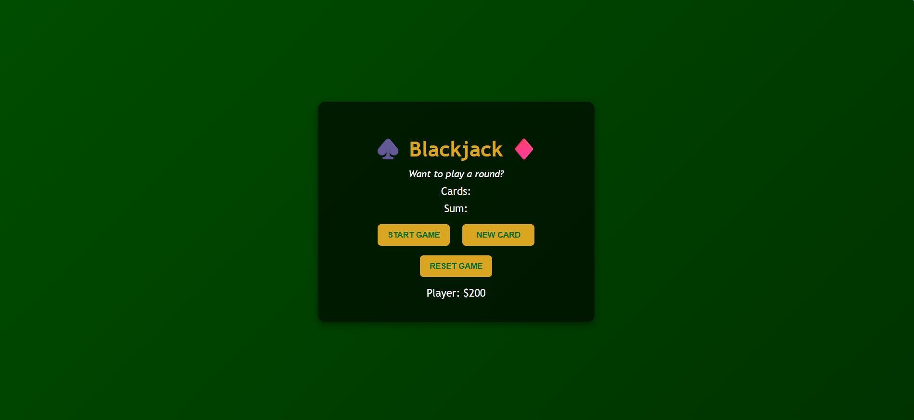

# ♠️ Blackjack ♦️

A simple Blackjack game built with **HTML, CSS, and JavaScript**.  
Start a round, draw new cards, and try your luck at hitting 21!

## Live Demo
👉 [Play Here]( https://akanchhak29.github.io/Blackjack-Game/)

## Features
- Start, Draw, and Reset buttons
- Basic chip system (+$50 on Blackjack, -$50 on bust)
- Responsive design

## How to Run
Just open `index.html` in your browser.  
(Optional: use VS Code “Live Server” for auto reload)

## Author
Made by [Akanchha Kumari](https://github.com/AKanchhaK29) 🎉

## License
MIT

